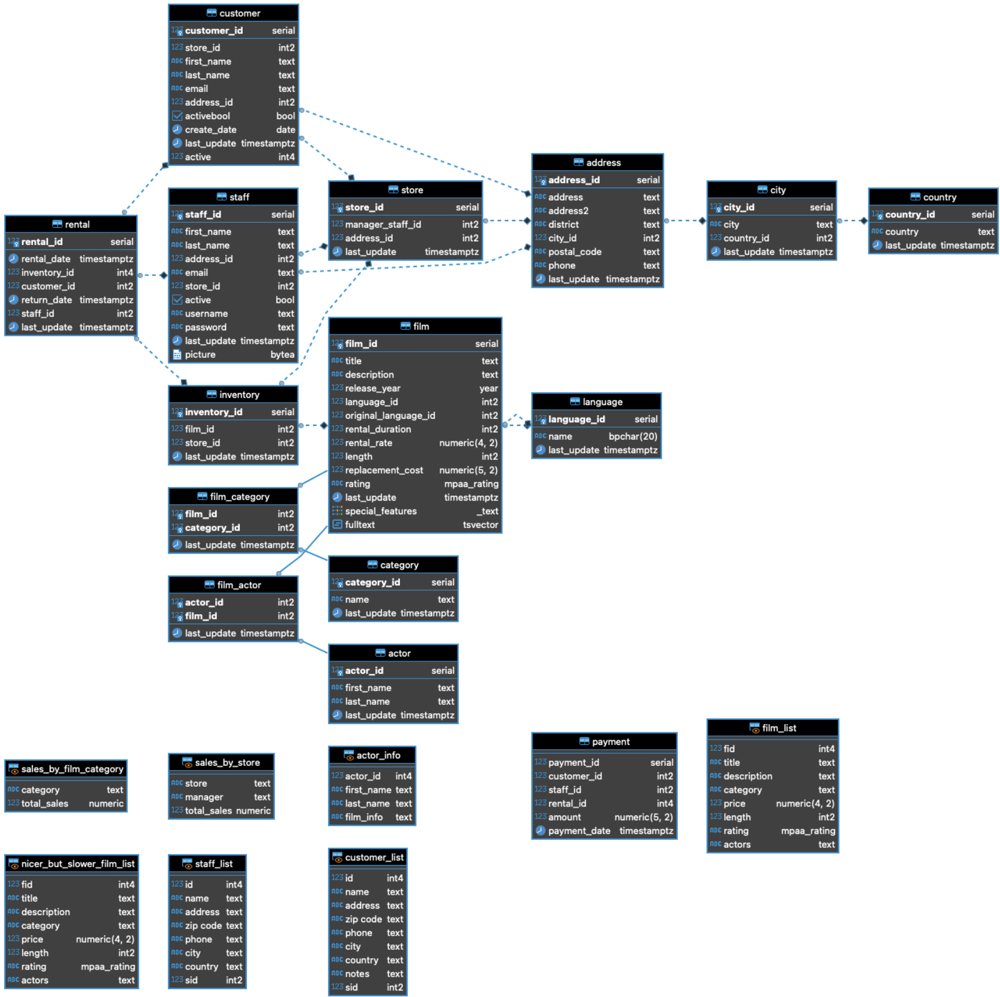
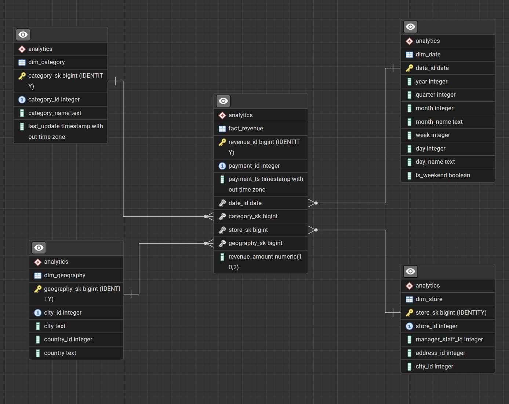
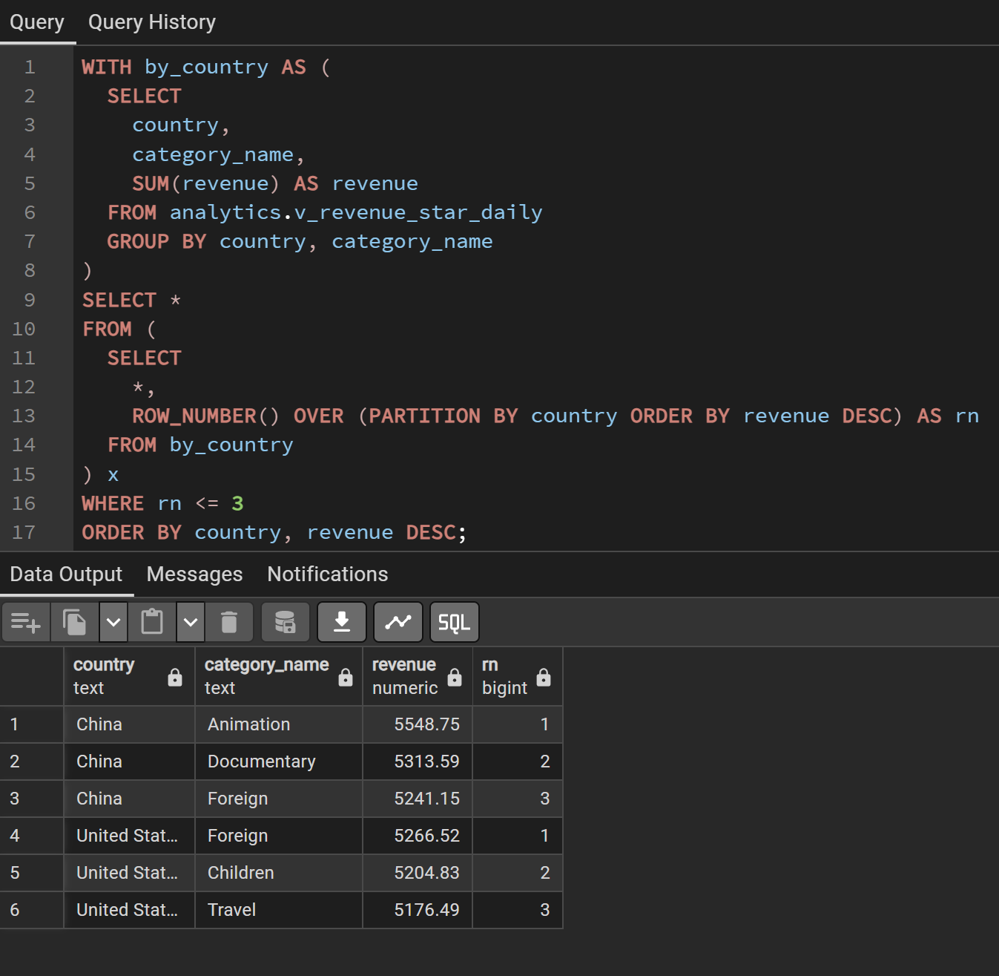
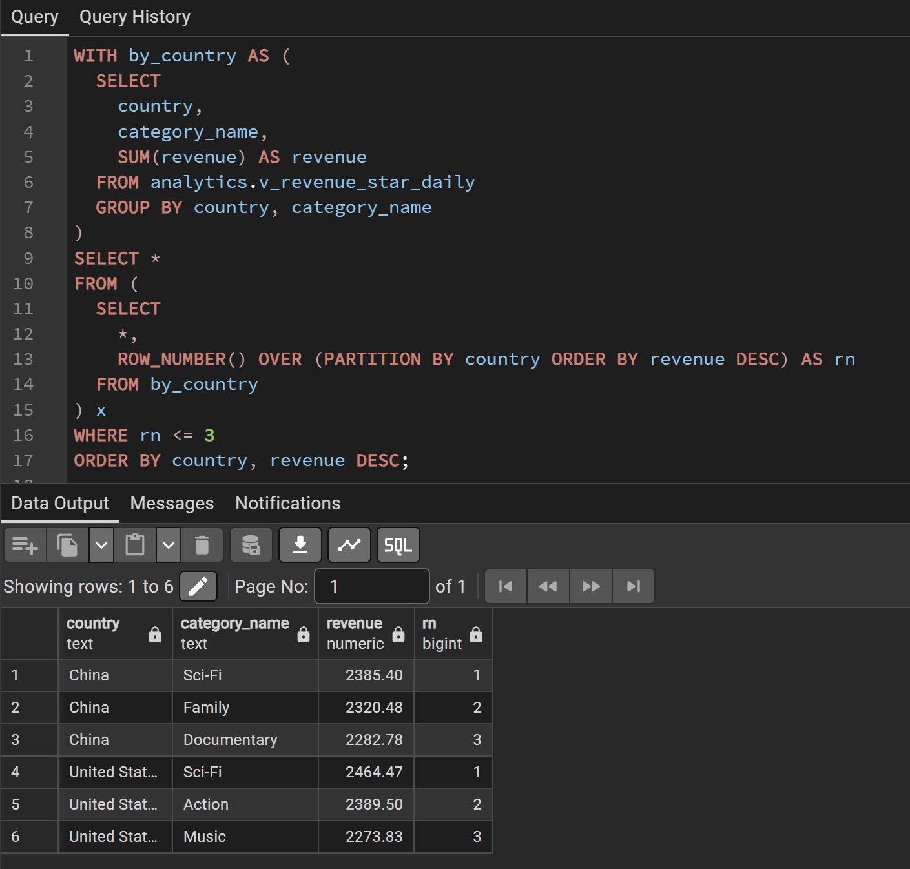

# Pagila Revenue Analytics  
### Dockerized Star Schema Data Warehouse

This project transforms the Pagila OLTP database into a fully reproducible analytical data warehouse using dimensional modeling, a star schema design, and Docker.

It demonstrates:
- Star schema modeling
- Fact and dimension table design
- Surrogate keys
- Clearly defined fact granularity
- SQL-based ETL
- Docker-based reproducibility
- Automated smoke testing

The result is a plug-and-play analytics environment that can be deployed in one command.

---

## Architecture Overview
```
    Pagila (OLTP)
        ↓
analytics.dim_date
analytics.dim_category
analytics.dim_store
analytics.dim_geography
        ↓
analytics.fact_revenue
        ↓
analytics.v_revenue_star_daily
        ↓
Business Views (monthly, category, country, top stores)
```


All transformations are executed automatically during PostgreSQL container initialization.

---

## Star Schema Design

This project uses a **star schema**:

- One central fact table: `analytics.fact_revenue`
- Multiple denormalized dimensions:
  - `dim_date`
  - `dim_category`
  - `dim_store`
  - `dim_geography`

This design was chosen because:
- It simplifies analytical queries
- It reduces join complexity
- It is optimized for aggregations
- It is the industry standard for analytical systems

---

## Fact Table Granularity

The grain of the fact table is:

> **One row per payment × category × store × geography × date**

Each row represents the revenue generated:
- At a specific time
- For a specific film category
- In a specific store
- In a specific city and country

This level of granularity allows:
- Time series analysis
- Category performance analysis
- Store performance analysis
- Geographic revenue analysis

---

## Dimensions

| Dimension       | Purpose                                  |
|----------------|------------------------------------------|
| dim_date       | Time analysis (year, quarter, month…)    |
| dim_category   | Film category analysis                   |
| dim_store      | Store performance                        |
| dim_geography  | City / Country analysis                  |

Surrogate keys are used in business dimensions to:
- Isolate analytics from OLTP identifiers
- Enable future Slowly Changing Dimension handling
- Follow dimensional modeling best practices

---

## Analytical Layer

The canonical analytical view is:

analytics.v_revenue_star_daily

It performs the star join and exposes business-friendly fields such as:
- year, quarter, month
- category_name
- store_id
- city, country
- revenue

Additional business views:
- `v_revenue_monthly`
- `v_revenue_by_category`
- `v_revenue_by_country`
- `v_top_stores`

These represent a semantic layer ready for BI tools.

---

## How to Run

Requirements:
- Docker
- Docker Compose
- PowerShell (Windows)

Start the warehouse:

```bash
docker compose up -d
powershell -ExecutionPolicy Bypass -File 
.\scripts\smoke_test.ps1
```

This will validate:

- Fact table population

- View existence

- Non-empty analytical results

## Project Structure
```
.
├── docker-compose.yml
├── .env
├── init/
│   ├── 01_schema_pagila.sql
│   ├── 02_data_pagila.sql
│   ├── 03_schema_analytics.sql
│   ├── 04_dim_tables.sql
│   ├── 05_fact_revenue.sql
│   ├── 06_time_analytics.sql
│   └── 07_views.sql
├── scripts/
│   └── smoke_test.ps1
├── docs/
│   ├── architecture.md
│   ├── granularity.md
│   ├── performance.md
│   └── extensions.md
└── screenshots/
    ├── ERD.png
    ├── star_schema.png
    ├── example_query1.png
    ├── example_query2.png
    └── example_query3.png
```

## Why This Project Matters?
### This project demonstrates:

- End-to-end data warehouse design

- Professional dimensional modeling

- Reproducible infrastructure

- SQL-driven transformation logic

- Engineering discipline via automated testing

- It shows the difference between writing queries and designing analytical systems.

## Visual Documentation

### Entity Relationship Diagram (ERD)

Shows the analytical schema with fact and dimension tables and their relationships.



---

### Star Schema Overview

Illustrates the final star schema design with `fact_revenue` at the center and denormalized dimensions around it.



---

### Example Analytical Queries

These screenshots demonstrate real analytical queries executed on the star schema.

#### 1. Daily Revenue by Category, Store and Geography
Shows how the star schema supports multi-dimensional slicing.



---

#### 2. Monthly Revenue Aggregation
Demonstrates time-based aggregation using the date dimension.


---

#### 3. Revenue by Category
Shows category-level performance analysis.



## Business Question

The main business problem addressed by this project is:

> **“How does revenue vary across time units and geography based on film category?”**

This analytical warehouse was designed to answer that question efficiently using a **star schema**, where:
- `fact_revenue` stores measurable business events (revenue),
- Dimension tables provide descriptive context:
  - `dim_date` → time
  - `dim_category` → film category
  - `dim_store` / `dim_geography` → location

This design allows fast aggregation and flexible slicing across all required analytical dimensions.

---

## Example Analytical Queries

The following queries demonstrate how the star schema answers the core business question from different perspectives.  
Screenshots of their execution and results are provided in the `screenshots/` folder.

---

### 1. Monthly Revenue by Geography and Film Category  
**

This query shows how different film categories perform in each country over time.

**Business meaning:**  
It reveals which genres generate the most revenue in specific regions and how this changes month by month.  
This is useful for:
- Regional marketing strategy
- Content localization decisions
- Market demand comparison

```sql
SELECT
    dd.year,
    dd.month,
    dd.month_name,
    dg.country,
    dc.category_name,
    SUM(fr.revenue_amount) AS total_revenue
FROM analytics.fact_revenue fr
JOIN analytics.dim_date dd       ON dd.date_id = fr.date_id
JOIN analytics.dim_category dc   ON dc.category_sk = fr.category_sk
JOIN analytics.dim_geography dg  ON dg.geography_sk = fr.geography_sk
GROUP BY
    dd.year, dd.month, dd.month_name,
    dg.country,
    dc.category_name
ORDER BY
    dd.year, dd.month,
    dg.country,
    total_revenue DESC;
```
### 2. Monthly Revenue Trend by Film Category

**

This query focuses on time and category only, ignoring geography.

**Business meaning:**

It highlights:

- Seasonal trends

- Growth or decline of specific categories

- Long-term category performance

**Useful for:**

- Demand forecasting

- Strategic investment in popular genres
```sql
SELECT
    dd.year,
    dd.month,
    dd.month_name,
    dc.category_name,
    SUM(fr.revenue_amount) AS total_revenue
FROM analytics.fact_revenue fr
JOIN analytics.dim_date dd       ON dd.date_id = fr.date_id
JOIN analytics.dim_category dc   ON dc.category_sk = fr.category_sk
GROUP BY
    dd.year, dd.month, dd.month_name,
    dc.category_name
ORDER BY
    dd.year, dd.month,
    total_revenue DESC;
```
### 3. Revenue by Geography and Film Category

**

This query compares category performance across different countries.

**Business meaning:**

It shows which genres are most profitable in each region and highlights geographical preferences.

**Useful for:**

- Market segmentation

- Region-specific content planning

- Revenue optimization
```sql
SELECT
    dg.country,
    dc.category_name,
    SUM(fr.revenue_amount) AS total_revenue
FROM analytics.fact_revenue fr
JOIN analytics.dim_category dc   ON dc.category_sk = fr.category_sk
JOIN analytics.dim_geography dg  ON dg.geography_sk = fr.geography_sk
GROUP BY
    dg.country,
    dc.category_name
ORDER BY
    dg.country,
    total_revenue DESC;
```
### Why This Design Works

The star schema allows:

- Simple joins (fact → dimensions)

- High query performance

- Clear analytical logic

- Business-friendly reporting

It directly supports slicing revenue by:
```md
| Dimension  | Example                     |
|------------|-----------------------------|
| Time       | Day, Month, Quarter, Year   |
| Geography  | Country, City, Store        |
| Category   | Film genre                  |
| Metric     | Revenue                     |
```
This structure reflects real-world analytical systems used in BI platforms and data warehouses.


---

For executing these queries:

- Use **pgAdmin4** for screenshots → it looks professional and clean.
- Use **PowerShell / psql** for smoke tests and automation.
- README screenshots should always come from **pgAdmin4** (or another GUI SQL client), because:
  - Better formatting
  - Easier to read
  - More portfolio-friendly

At this point your project is no longer “just SQL + Docker”  
It’s a **complete analytical data warehouse with business storytelling.**
